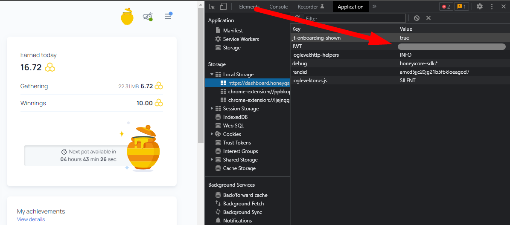
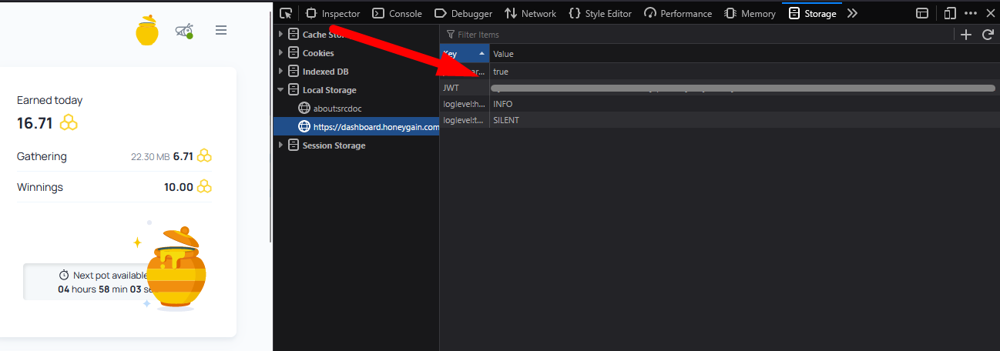

# AutomaticHoneypot
A script that automatically claims the rewards from the honeypot in HoneyGain

The script uses an HTTP request to attempt to claim the rewards from your honeypot in HoneyGain every 5 hours (so that it doesn't matter if it's not synced).

In order for the script to claim the honeypot for your account, you need to find your Bearer authentication token and paste it into a file called "token.txt" in the folder of the script (it's important that it is called exactly like that and it is in the same folder as the script)

## How to run the script
### Method 1:
Download the "AutomaticHoneypot.exe" file and run it.
### Method 2:
1. Install Python
2. Run the command "python main.py" in the same directory as the script

## How to find the Bearer token

### Chrome
Log into HoneyGain. Press F12 to open up the Chrome devtools and navigate to the "Application" tab (you might have to click on the button that's on the right of the "Application" tab seen in the screenshot in order to find it)
Expand "Local Storage" on the left and click on the first item. The token is located next to where it says "JWT" (it's hidden in the screenshot).

### Firefox:
Log into HoneyGain. Press F12 to open up the Firefox devtools and navigate to the "Storage" tab. The next steps are the same as for Chrome.

